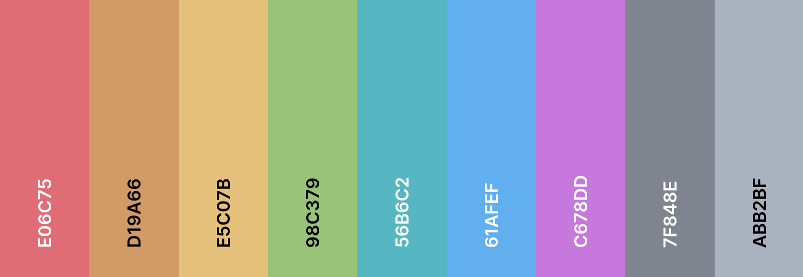

# PyDark Theme 🐍

Tema escuro para o [**Visual Studio Code (VS Code)**](https://code.visualstudio.com/) 🖋️, projetado para elevar a experiência de codificação 👨‍💻 em [**Python**](https://www.python.org/). Combinando sofisticação, modernidade e conforto visual, o **PyDark** 🐍 é a escolha ideal para um ambiente elegante, funcional - _e, principalmente, pythonico!_ 🚀

<br />

## 📌 Destaques

- 🌈 **Paleta Customizada:** Cores escolhidas para destacar a sintaxe da linguagem Python;
- 💻 **Conforto Visual:** Ideal para longas sessões de codificação, reduzindo a fadiga ocular;
- ✨ **Design Minimalista:** Estilo simples, voltado a minimizar distrações em seu _workspace_.

<br />

## 🎨 Paleta de Cores

<div align="center">
  
  <p><i>Inspirada nas cores marcantes do clássico tema One Dark, do saudoso <b><a href="https://github.com/atom/atom">Atom</a></b> - editor de texto desenvolvido pelo GitHub e descontinuado em dezembro de 2022 -, a paleta de cores do <b>PyDark</b> 🐍 foi cuidadosamente selecionada para destacar a sintaxe Python com elegância, garantindo conforto visual e reduzindo a fadiga ocular.</i></p>
</div>

<br clear="both">

## ⚙️ Instalação

### I. Via Marketplace

- Com o **VS Code** aberto, acesse a barra de título ou pressione as teclas `Ctrl + P`;
- Aberta a barra de título, cole o comando `ext install germanocastanho.pydark-theme`;
- Ou então, busque por `PyDark Theme` na aba de extensões e, em seguida, instale-o.

<br />

### II. Via GitHub (Manual)

- Clone o repositório em sua máquina e navegue até a pasta raiz do projeto;
- Com o **teminal** aberto, e o [`vsce`](https://github.com/microsoft/vscode-vsce) instalado, execute o comando `vsce package`;
- Pressione `Ctrl + Shift + P` e selecione `Extensions: Install from VSIX...`;
- Selecione o arquivo `pydark-theme-1.0.0.vsix` gerado na pasta raiz do projeto.

<br />

## 🛠️ Recomendações

Para garantir o máximo proveito da experiência visual proporcionada pelo **PyDark** 🐍, recomendam-se algumas **configurações específicas** ⚙️ do VS Code, que juntas proporcionam uma interface 💻 mais harmoniosa e agradável aos olhos. Lembre-se de que tais configurações devem ser adicionadas diretamente ao arquivo `settings.json` 📜.

```json
{
  "editor.fontFamily": "Fira Code",
  "editor.fontSize": 14,
  "editor.fontWeight": "500",
  "editor.fontLigatures": true,
  "editor.lineHeight": 21,
  "workbench.iconTheme": "material-icon-theme",
  "material-icon-theme.opacity": 0.5
}
```

<br />

## 🧩 Compatibilidade

Embora tenha por foco estético a linguagem Python, o tema é **altamente compatível** com outras linguagens de programação 👨‍💻; entretanto, vale ressaltar que a utilização do **PyDark** 🐍 com outras linguagens pode resultar em uma estética não muito agradável às preferências de todos usuários 😑. **Experimentação é a chave!** ✨

<br />

## 🤝 Contribuições

Contribuições são sempre bem-vindas! Se deseja colaborar, siga [boas práticas](https://peps.python.org/pep-0008/) em Python e sugira melhorias relevantes. Faça um fork 🔱 do repositório, implemente suas alterações e envie um pull request. Caso encontre problemas ou tenha sugestões 🤔, abra uma [issue](https://github.com/germanocastanho/pydark-theme/issues). Juntos, podemos tornar o **PyDark** 🐍 ainda mais incrível! 🚀

<br />

## 📜 Licença GPL-3.0

Distribuído sob a [**Licença Pública Geral GNU v3.0 (GPL-3.0)**](https://www.gnu.org/licenses/gpl-3.0.html), garantindo liberdade de uso, modificação e redistribuição do software ✊, desde que preservados os mesmos direitos ⚖️ em quaisquer versões derivadas. Ao utilizar ou contribuir com o projeto, você apoia a filosofia de **software livre** e a promoção de um ambiente colaborativo e aberto à inovação! 🔬

<br />

## ✉️ Contato

Quer **colaborar com o projeto** 💻 ou apenas **trocar ideiais?** 🧠 Todas as formas de contato e redes sociais estão disponíveis no meu [**Linktr.ee**](https://linktr.ee/germanocastanho)! 🌳 Fico à disposição para discutir Tecnologia, Filosofia, Direito ou qualquer ideia interessante que nos inspire a criar algo novo 🚀. Obrigado por visitar este espaço e por dedicar seu tempo! Saúde, e nos vemos na próxima! 👋

<br />

**Cada linha, um manifesto pela liberdade!** ✊🏴
